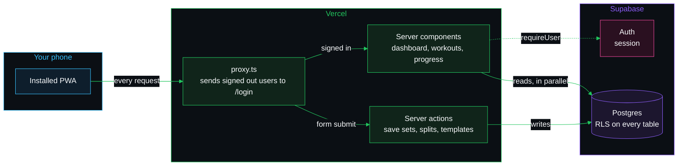

<div align="center">


# Workout Tracker

A mobile-first PWA for logging gym sessions: splits, templates, supersets,
dropsets, rest timers, body weight, and per-exercise strength progression.


</div>

## What it does

| | |
|---|---|
| **Splits** | A weekly rotation. The dashboard works out which day comes next from what you did last. |
| **Templates** | Saved workouts. Link one to a split day and start straight from it. |
| **Supersets and dropsets** | Pair exercises or chain drop sets inside a session. |
| **Rest timer** | A custom timer between sets. |
| **Body weight** | Log it daily and watch the trend. |
| **Strength progression** | Per-exercise charts, with PRs calculated from estimated one-rep max. |
| **Hall of fame** | Pin up to three lifts to the dashboard with your heaviest set. |
| **CSV export** | Every session and set, out as a spreadsheet. |

## How it fits together

Next.js App Router on Vercel, with Supabase for auth and Postgres.

<!-- Diagram colours come from src/app/globals.css and the app icon. Keep them in sync. -->



> [!NOTE]
> Access control lives in Postgres, not in the app. Every table has RLS policies
> keyed on `auth.uid()`. The Supabase anon key is public by design, which is why
> those policies are the part that actually protects the data.

The data model, the dashboard load path and the workout lifecycle each have a
diagram in [`docs/architecture.md`](docs/architecture.md).

## Setup

Create `.env.local`:

```
NEXT_PUBLIC_SUPABASE_URL=https://<project>.supabase.co
NEXT_PUBLIC_SUPABASE_ANON_KEY=<anon key>
```

> [!IMPORTANT]
> Run the SQL files in the Supabase SQL editor in this order. The seed depends on
> the tables existing.
>
> 1. `supabase_schema.sql` creates the tables, RLS policies and the new-user trigger.
> 2. `exercises_v2.sql` seeds about 870 exercises from
>    [free-exercise-db](https://github.com/yuhonas/free-exercise-db).

```bash
npm install && npm run dev
```

## Layout

| Path | What lives there |
| --- | --- |
| `src/app/` | Routes. `actions.ts` files hold the server actions for that section. |
| `src/components/workout/` | The workout editor: shared types, the `useWorkoutExercises` hook, and the two screens (active and edit) built on it. |
| `src/components/ui/` | shadcn primitives. |
| `src/lib/supabase/` | Browser, server, and proxy clients. `requireUser()` / `requireUserAction()` resolve the signed-in user. |
| `src/proxy.ts` | Redirects anonymous requests to `/login` before any page renders. |

## Docs

| File | Covers |
|---|---|
| [`overview.md`](docs/overview.md) | What this is for, and what a normal session looks like |
| [`architecture.md`](docs/architecture.md) | Stack, data model, load path, workout lifecycle, and past decisions |
| [`standards.md`](docs/standards.md) | How code and prose are written here |
| [`progress.md`](docs/progress.md) | Where things stand right now |
| [`changes.md`](docs/changes.md) | Why things changed, in order |
