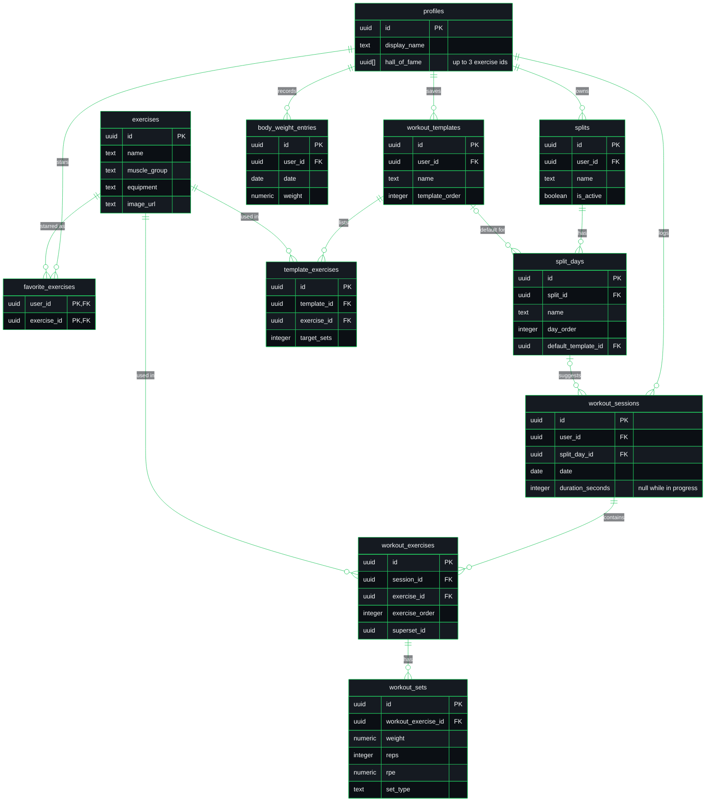
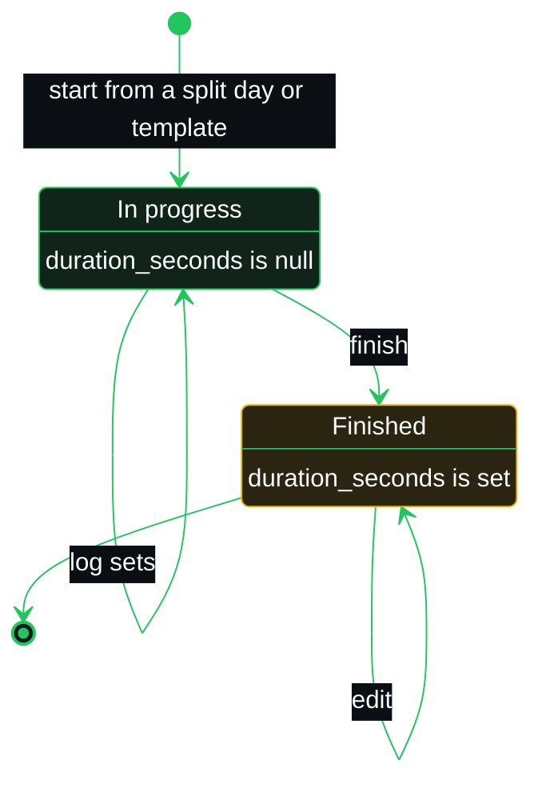

# Architecture

## Stack

| Layer | Choice | Why |
|---|---|---|
| Framework | Next.js, App Router | Server components and Vercel deployment |
| Data and auth | Supabase (Postgres, RLS) | Managed Postgres with auth attached |
| Styling | Tailwind and shadcn | Component primitives without a heavy UI library |
| Charts | recharts | Strength progression graphs |
| Drag and drop | dnd-kit | Template arrangement |
| Offline | `@ducanh2912/next-pwa` | Installable on a phone |

## Shape

| Path | What lives there |
|---|---|
| `src/app/` | Routes, server actions, page-level clients |
| `src/components/` | Shared and feature components |
| `src/lib/` | Supabase clients and helpers |
| `src/types/` | Shared types |
| `*.sql` | Schema, RLS policies, and the exercise seed |

## Platform constraints

**Vercel.** Serverless, so there is no persistent filesystem and nothing can be
cached on disk between requests. The build has to pass or nothing ships.

**Supabase.** The anon key is `NEXT_PUBLIC_` and therefore visible to anyone who
opens the site. Row Level Security is what actually protects the data, which
makes the policies in `supabase_schema.sql` part of the security boundary rather
than just schema.

## Decisions

### 2026-09-11: keep the stack, find the real cause of the slow load

**Chose:** Diagnose the 20 second load before changing any of the stack.

**Because:** Next.js and Supabase both serve fast apps routinely. A load time
that bad points at something specific in this codebase, and swapping the stack
would cost weeks while probably carrying the same bug across.

**Rejected:** Replacing the framework or the database. No evidence yet that
either is the problem.

### 2026-09-11: what the slow load turned out to be

Reading `src/app/page.tsx` settled it. The dashboard is a server component that
made **nine sequential round trips** to Supabase before rendering anything, with
no `Promise.all` in the file. Every route is `ƒ` dynamic, so this ran on every
single load with nothing cached.

Two queries were independently expensive. One pulled all roughly 870 exercises
on every render to feed an editor dialog that shows 50 at a time and may never
be opened. The other joined `exercises` to `workout_exercises` to `workout_sets`
with no limit, pulling every set ever recorded and sorting in JavaScript to find
one maximum. That second one gets worse the longer the training history is.

**Fixed by:** collapsing the independent queries into `Promise.all`, which took
nine round trips down to three. The exercise list now loads when the dialog
opens. Each hall of fame entry asks for its single heaviest set with `order` and
`limit(1)`.

The bundle-size theory was never tested and remains open. It was not needed to
explain the delay.

<!-- Diagram colours come from src/app/globals.css and the app icon. Keep them in sync. -->

## Data model

Every table hangs off `profiles`, and RLS checks ownership through that chain.
`exercises` is the one shared table: everyone reads it, nobody owns it.

## Load path

What happens between opening the dashboard and seeing it. Everything inside a
`par` block runs at the same time.

```mermaid
%%{init: {"theme": "base", "themeVariables": {"actorBkg": "#151A21", "actorBorder": "#22C55E", "actorTextColor": "#F8FAFC", "actorLineColor": "#475569", "signalColor": "#22C55E", "signalTextColor": "#F8FAFC", "labelBoxBkgColor": "#151A21", "labelBoxBorderColor": "#38BDF8", "labelTextColor": "#F8FAFC", "loopTextColor": "#F8FAFC", "noteBkgColor": "#1E293B", "noteTextColor": "#F8FAFC", "noteBorderColor": "#38BDF8", "activationBkgColor": "#22C55E", "activationBorderColor": "#22C55E"}}}%%
%% palette 219897bf
sequenceDiagram
    participant P as Phone
    participant D as Dashboard<br/>server component
    participant A as Supabase Auth
    participant DB as Postgres<br/>RLS enforced

    rect rgb(21, 26, 33)
        P->>D: open dashboard
        D->>A: requireUser()
        A-->>D: session
    end

    rect rgb(16, 36, 26)
        par Round 1, all at once
            D->>DB: profile
        and
            D->>DB: last workout
        and
            D->>DB: weekly count
        and
            D->>DB: body weight
        and
            D->>DB: active split
        end
        DB-->>D: five results
    end

    rect rgb(14, 30, 44)
        par Round 2, all at once
            D->>DB: split days
        and
            D->>DB: hall of fame names
        and
            D->>DB: heaviest set per exercise
        end
        DB-->>D: rows
    end

    rect rgb(28, 22, 46)
        opt Round 3, only when the split day links a template
            D->>DB: matching template
            DB-->>D: row
        end
        D-->>P: rendered page
    end
```

Before the fix this was nine arrows in a single column, each one waiting for the
last.

## Workout lifecycle

A session has no status column. Whether it is finished comes down to one field.

The dashboard's "last workout" card and the weekly count both filter on
`duration_seconds` being set, so an abandoned session never shows up in either.
