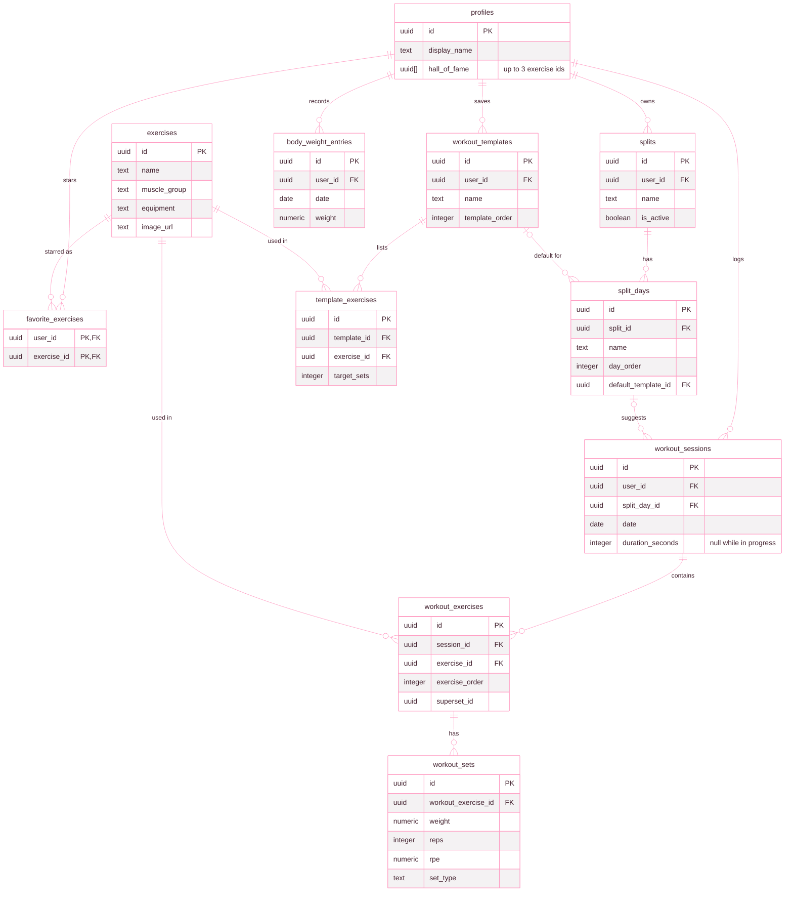
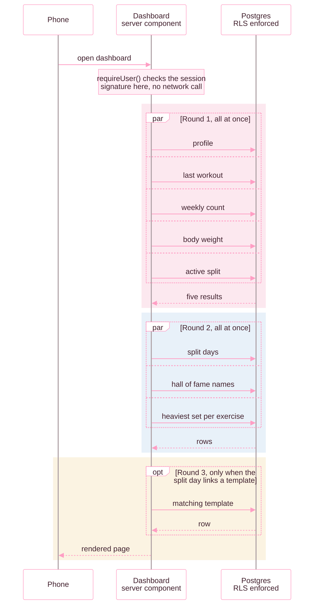
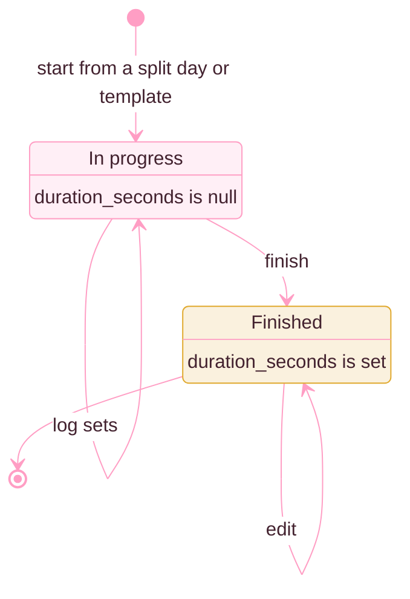

# Architecture

## Stack

| Layer | Choice | Why |
|---|---|---|
| Framework | Next.js, App Router | Server components and Vercel deployment |
| Data and auth | Supabase (Postgres, RLS) | Managed Postgres with auth attached |
| Styling | Tailwind and shadcn | Component primitives without a heavy UI library |
| Charts | recharts | Strength progression graphs |
| Drag and drop | dnd-kit | Template arrangement |
| Offline | Web app manifest, and a hand-written service worker in `public/sw.js` | Installable, and opens on the phone's saved copy of the home screen |

## Shape

| Path | What lives there |
|---|---|
| `src/app/` | Routes, server actions, page-level clients |
| `src/components/` | Shared and feature components |
| `src/lib/` | Supabase clients and helpers |
| `src/types/` | Shared types |
| `*.sql` | Schema, RLS policies, and the exercise seed |

## Platform constraints

**Vercel.** Serverless, so there is no persistent filesystem and nothing can be
cached on disk between requests. The build has to pass or nothing ships.

**Supabase.** The anon key is `NEXT_PUBLIC_` and therefore visible to anyone who
opens the site. Row Level Security is what actually protects the data, which
makes the policies in `supabase_schema.sql` part of the security boundary rather
than just schema.

## Decisions

### 2026-09-11: keep the stack, find the real cause of the slow load

**Chose:** Diagnose the 20 second load before changing any of the stack.

**Because:** Next.js and Supabase both serve fast apps routinely. A load time
that bad points at something specific in this codebase, and swapping the stack
would cost weeks while probably carrying the same bug across.

**Rejected:** Replacing the framework or the database. No evidence yet that
either is the problem.

### 2026-09-11: what the slow load turned out to be

Reading `src/app/page.tsx` settled it. The dashboard is a server component that
made **nine sequential round trips** to Supabase before rendering anything, with
no `Promise.all` in the file. Every route is `ƒ` dynamic, so this ran on every
single load with nothing cached.

Two queries were independently expensive. One pulled all roughly 870 exercises
on every render to feed an editor dialog that shows 50 at a time and may never
be opened. The other joined `exercises` to `workout_exercises` to `workout_sets`
with no limit, pulling every set ever recorded and sorting in JavaScript to find
one maximum. That second one gets worse the longer the training history is.

**Fixed by:** collapsing the independent queries into `Promise.all`, which took
nine round trips down to three. The exercise list now loads when the dialog
opens. Each hall of fame entry asks for its single heaviest set with `order` and
`limit(1)`.

The bundle-size theory was never tested and remains open. It was not needed to
explain the delay.

### 2026-09-12: run the functions beside the database, verify sessions locally

**Chose:** Vercel functions in Seoul (`icn1`), the same AWS region as the
Supabase database (`ap-northeast-2`), and `getClaims()` in place of `getUser()`
in the proxy and `requireUser()`.

**Because:** Vercel runs new projects in Washington D.C. With the database in
Seoul, every sequential query crossed the Pacific, and the proxy and each page
then made two more round trips to Supabase Auth to find out who the user was.
The project signs sessions with an ES256 key, so `getClaims()` can check the
signature on the server against a public key it caches.

**Trade-off:** a session revoked on Supabase's side still gets through the app's
page checks until its access token expires, at most an hour. Data access is
unaffected, because the browser already queries Supabase with that same token
and RLS checks it on every request.

**Rejected:** moving the database to Mumbai, closer to the phone. That would mean
a new Supabase project and a data migration, where the region change is one
line of config.

### 2026-09-12: open on the phone's copy of the home screen

**Chose:** a hand-written service worker that serves the home screen from the
phone and refreshes it in the background, full prefetch for the bottom-nav tabs
other than Exercises, and the Supabase library loaded on demand wherever a page
doesn't need it at startup.

**Because:** after the region fix, every open still waited on the network before
anything appeared. Reaching Vercel's Mumbai edge alone took 0.1 to 0.36 seconds,
then the page came from Seoul, then the phone ran about 1 MB of JavaScript. A
copy on the device is the only way the first screen can appear without that wait.

**Trade-off:** the home screen can show the previous visit's numbers for a moment
before current data arrives. After a deploy, the first open shows the old version
until Next notices the build changed and reloads. The saved home screen holds the
signed-in user's data on the phone until they sign out or the login page loads.

**Rejected:** Serwist, which Next's PWA guide says still needs webpack. A
persisted client-side data cache for every screen, such as TanStack Query, which
means a new dependency and a rewrite of each page; kept in reserve in case this
is not enough. Caching every route in the service worker: Next's page data
requests vary with router state, and a cached workout screen would hide edits
made since.

<!-- Diagram colours come from src/app/globals.css and the app icon. Keep them in sync. -->

## Data model

Every table hangs off `profiles`, and RLS checks ownership through that chain.
`exercises` is the one shared table: everyone reads it, nobody owns it.

## Load path

What happens between opening the dashboard and seeing it. Everything inside a
`par` block runs at the same time.

Before the fix this was nine arrows in a single column, each one waiting for the
last.

## Workout lifecycle

A session has no status column. Whether it is finished comes down to one field.

The dashboard's "last workout" card and the weekly count both filter on
`duration_seconds` being set, so an abandoned session never shows up in either.
