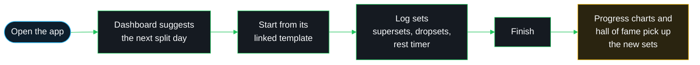

# Overview

## What this is

A mobile-first progressive web app for logging gym sessions. It handles splits,
templates, supersets, dropsets, rest timers, body weight and per-exercise
strength progression.

The README covers setup and the directory layout. This file covers the why.

## A normal session

## Who it is for

One person, for now. There is no team and no plan for other users yet, so
anything built for a hypothetical second user is speculative until that changes.

## Done looks like

The app takes around 20 seconds to load. The current milestone is a fast first
paint on a phone, and no new feature ships before that lands.

## Explicitly out of scope

- New features until the load time is fixed
- Multi-user or social features
- Anything that assumes a persistent filesystem, since Vercel does not provide one
